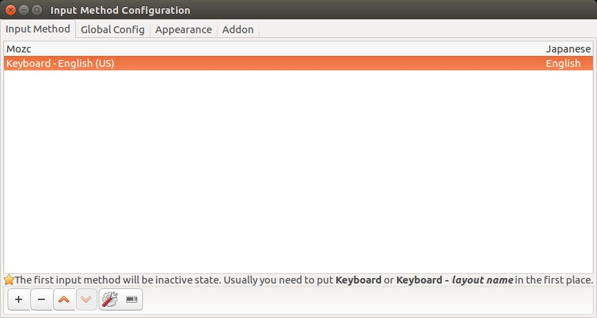
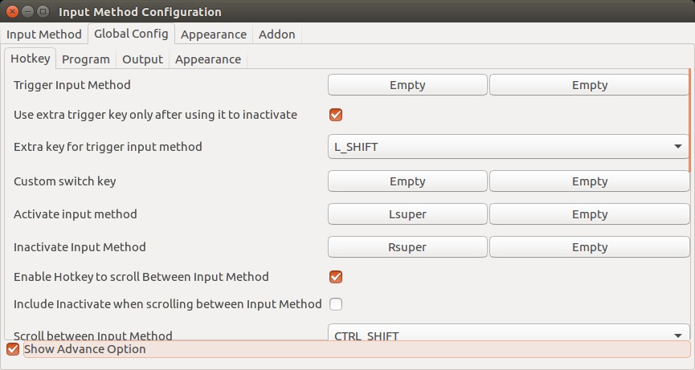

<h1 align="center">
  dotfiles
</h1>

<h4 align="center">
  My dotfiles.
</h4>

<div align="center">
  <a href="https://travis-ci.org/wkentaro/dotfiles"></a>
  <a href="https://hub.docker.com/r/wkentaro/dotfiles/"></a>
</div>

<br/>

<div align="center">
  
</div>


## Usage

```bash
INSTALL_DIR=$HOME/.dotfiles  # you can change this location
git clone --recursive https://github.com/wkentaro/dotfiles.git $INSTALL_DIR && cd $INSTALL_DIR
./install.py
```


## Docker

You can try my shell env in docker.

```bash
docker run -it wkentaro/dotfiles
```


## macOS

### iTerm2

* Download iTerm color schemes from https://github.com/mbadolato/iTerm2-Color-Schemes.
* `Iterm2 > Preferences > Profiles > Colors > Load Presets > __Dark Pastel__`.


## Ubuntu 16.04

### Input Method

* Select `fcitx` for `Keyboard input method system` in `Language Support`.
* Logout + login.
* Open fcitx settings and configure as below:



